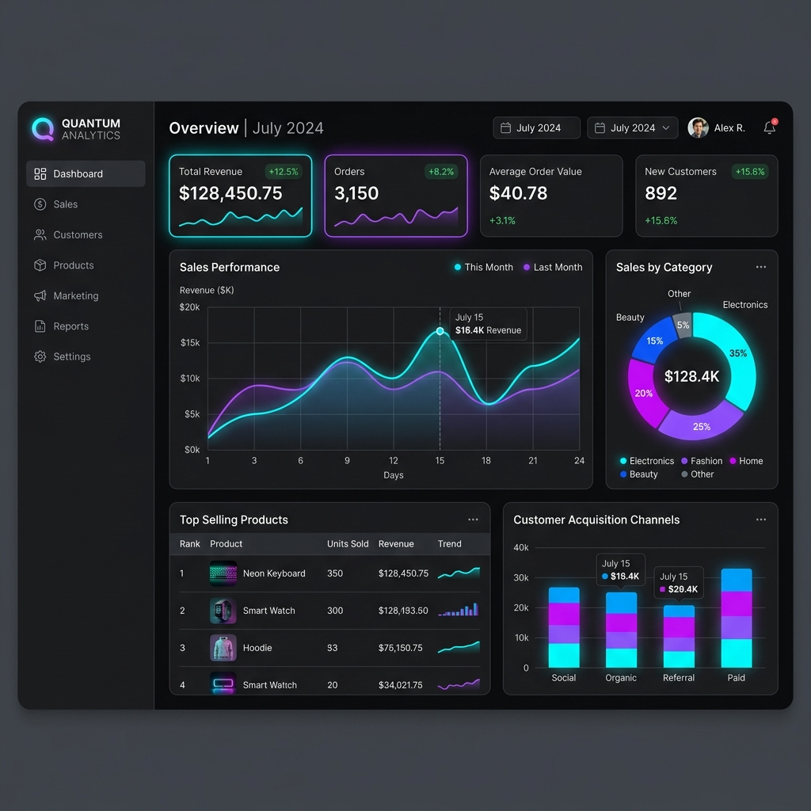
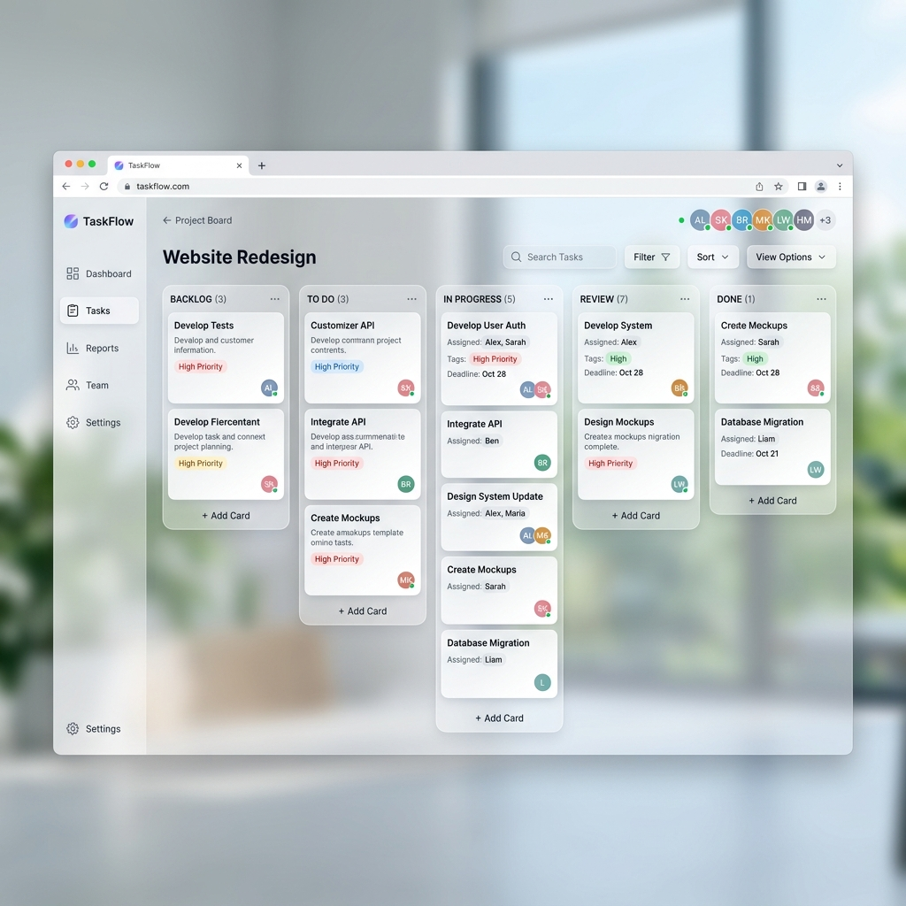
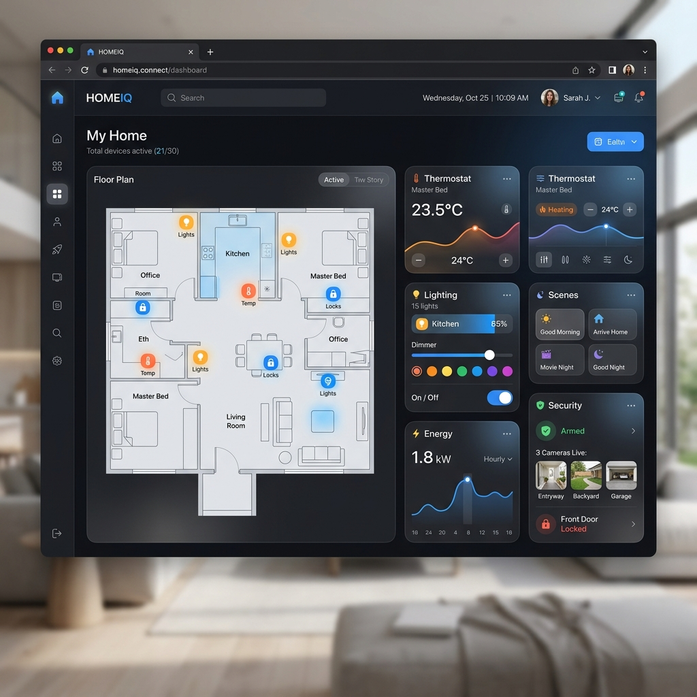

# ⚡ morgan.sys — Digital Identity System

A restrained, emotionally intelligent, and founder-grade **Digital Identity System** built with pure **Vanilla HTML5, CSS3, and ES6+ JavaScript**. Sitting at the intersection of Stripe, Linear, Vercel, and Apple product storytelling, this interface prioritizes silence, controlled asymmetry, and physical stability over standard portfolio templates.

---

## 🎨 Visual Composition

### Profile & Systems Telemetry
<p align="center">
  
</p>

<p align="center">
  
  
  
</p>

---

## 🚀 Architectural Principles

* **🤫 Sparing Serif Contrast**: `Instrument Serif` is restricted strictly to hero declarations and key editorial headers, leaving the main navigation, interactive controls, tags, and data descriptions in modern, minimal sans-serif (`Inter`) for crisp UI legibility.
* **📏 Controlled Asymmetry**: Replaces symmetrical desktop grids with offset columns, mixed content widths, and deliberate whitespace imbalances that give sections immense breathing room.
* **🧱 Physical Stability**: Replaces floating random components and high-energy animation decoration with anchored, flat layout blocks, subtle panel elevations, and ultra-thin, silent micro-borders (`1px solid rgba(255, 255, 255, 0.04)`).
* **🕵️ Signal-Intelligent Pacing**: Navigated by a structured numbered directory that quietly implies internet-native taste:
  * `01 / System` (Hero/Intro)
  * `02 / Philosophy` (Approach/Systems)
  * `03 / Builds` (Architectures/Projects)
  * `04 / Intel` (Capabilities/Technical Depth)
  * `05 / Connect` (Secure Routing Gateway)
* **📑 Intelligence Briefings**: Projects are structured as rigorous product teardowns rather than shallow generic cards, detailing **Intent**, **Infrastructure**, **Perception**, and **Outcome**.
* **🌓 Silent Theme Persistency**: A minimal, sliding sun/moon theme selector that syncs with `localStorage` and listens live to system `prefers-color-scheme` preferences. Includes an inline blocking theme injector in the `<head>` to prevent the Flash of Unstyled Content (FOUC).
* **🍂 Near-Invisible Motion**: Focuses on atmospheric, physically aware transitions. Replaces bouncy visual effects with very slow, quiet fades and fine vertical shifts that support depth without drawing attention.

---

## 📂 System Map

```text
personal-portfolio/
├── assets/
│   ├── avatar.png       # High-fidelity developer profile illustration
│   ├── project-1.png    # E-commerce Dashboard mockup
│   ├── project-2.png    # SaaS Kanban Board mockup
│   ├── project-3.png    # Smart Home UI mockup
│   └── resume.pdf       # Professional PDF resume document
├── index.html           # Highly accessible semantic HTML5 architecture
├── styles.css           # Modern design system & viewport fluid typography
├── script.js            # Light/Dark controller, observers, & Form handler
└── README.md            # Repository documentation
```

---

## 🛠️ Local Development

Running this digital identity locally is extremely fast since it operates on pure, uncompiled static standards.

1. **Clone the repository**:
   ```bash
   git clone https://github.com/aruntito/portfolio.git
   cd portfolio
   ```

2. **Run a static server**:
   
   *Using Node.js (`http-server`)*:
   ```bash
   npx http-server ./
   ```
   
   *Using Python 3*:
   ```bash
   python3 -m http.server 8080
   ```

3. Open **`http://localhost:8080`** in your browser.

---

## 🌐 Production Deployment

This project consists of static files and is optimized for sub-100ms loading speeds.

### GitHub Pages
1. Go to your repository settings on GitHub.
2. Navigate to **Pages** under the "Code and automation" section.
3. Set the build source to **Deploy from a branch**.
4. Select the `main` branch and `/ (root)` folder, then click **Save**.

### Vercel / Netlify
1. Connect your GitHub account to [Vercel](https://vercel.com) or [Netlify](https://netlify.com).
2. Import the `portfolio` repository.
3. Click **Deploy** (no build commands or output directory settings are required).
